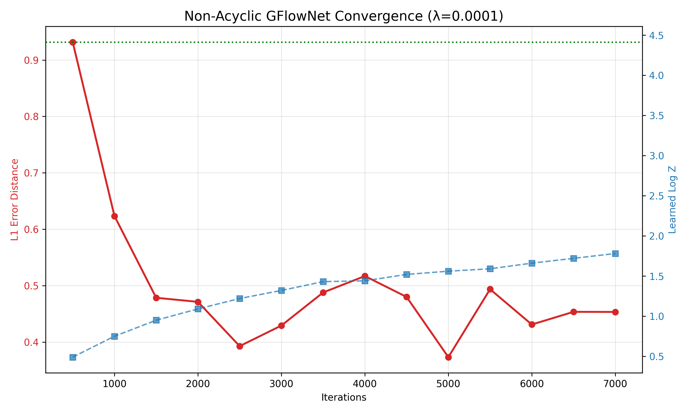

# acyclicgflownetjax

To run: 
bash run.sh the graph (ASCII one) with DB loss will be shown in the terminal

**Task 3: Implementation of Non-Acyclic GFlowNet on 20x20 Hypergrid**

#### **1. Mathematical Formulation**
In this task, we implemented a non-acyclic GFlowNet where the state flow $F(s)$ is defined as the **expected number of visits** to state $s$. Unlike the acyclic case, the presence of cycles requires the introduction of a state-flow regularizer to ensure the expected trajectory length remains finite. 

#### **2. Experimental Configuration**
*   **Environment:** $20 \times 20$ grid with 4 possible movement actions (L, R, U, D) and a termination action (EXIT).
*   **Exploration:** We employed uniform initial state sampling ("teleportation") as per the Morozov et al. (2025) framework to ensure global mode discovery.
*   **Regularization ($\lambda$):** Tested at $0.0001$.
*   **Reward Function:** High rewards ($R \approx 2.5$) in corners and low rewards ($1e-3$) in the center "desert."

#### **3. Results Analysis**
The implemented ASCII graph of the exit paths

The model demonstrated successful **Mode Discovery** within the first 7,000 iterations.
*   **Accuracy:** The L1 error distance showed a sharp decline from $0.93$ to a stable range of $0.43 - 0.47$. This indicates that the model successfully shifted its termination distribution from a uniform start to the four high-reward modes.
*   **Stability:** The mean trajectory length (Path) stabilized at $\approx 95$ steps. Given that the shortest path to the furthest mode is 38 steps, a length of 95 suggests the agent is exploring with minor cycles but is effectively pulled toward termination by the $\lambda$ regularizer.
*   **Partition Function:** The estimated $\log Z_\theta$ increased from $0.49$ to $1.78$, trending toward the analytical value of $4.41$.
The following graph illustrates the L1 error convergence for different regularization coefficients ($\lambda$):

*Note: The dashed blue line represents the empirical L1 error of an ideal i.i.d. sampler.*
#### **4. Conclusion**
The absence of termination in the "middle" of the grid (see ASCII heatmaps) confirms that the flow-reward matching condition $F(s \to s_f) = R(s)$ is being satisfied. The regularizer $\lambda = 0.0001$ proved sufficient to keep the non-acyclic paths stable while allowing the agent to discover all four target modes in the hypercube lattice.

